# ai-sprite-animator

Turn a short AI generated video of a pixel art character into a game ready sprite sheet.

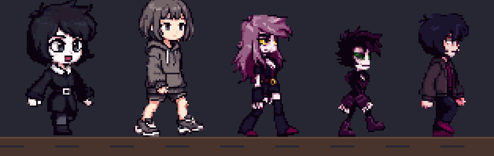

> **Read this first.** The output is a very good starting point, not a finished sprite. Every frame is a faithful reconstruction of one video frame, so the eyes, nose and mouth can shift by a pixel between frames and the outline can breathe a little. Expect to clean up a few frames by hand or to stabilise the face if your game needs a rock steady head. Overall the walk, the silhouette and the colours come through very well.

**Suggested grid:** `4.5` px cells, which gives roughly a 43x80 sprite from a 544 px Grok clip. If you want something more retro, `6.0` px cells give roughly 32x61. Both are shown for every example below.

## How it works

1. **Generate the clip on a green screen.** Ask the video model for a flat `#00FF00` background with nothing green on the character, no shadow, no ground line. The prompts that worked are in [docs/prompts.md](docs/prompts.md).

   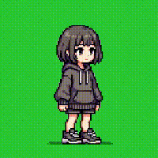

2. **Intake.** `intake.py` reads the clip and reports the background colour, whether any part of the character is background coloured, shadow, drift, the walk period and the pixel grid the model actually drew. It tells you whether to proceed, fix, or regenerate, and why.

   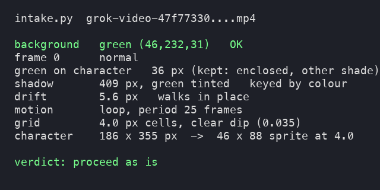

3. **Key.** `key_green.py` removes the green. Green that touches the edge of the frame or matches the screen colour is background; green that is enclosed in the character and a different shade (green eyes, hair highlights) is kept. The outer pixels of the silhouette are recoloured from the inside so no green bleeds into the sprite. Always check the result on magenta, which is what `all_frames_magenta.png` is for.

   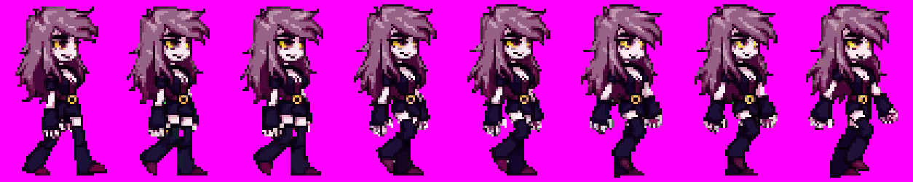

4. **Pick the grid.** `grid_compare.py` reconstructs one character at 1, 2, 3, 3.5, 4, 4.5 and 6 px cells and puts them side by side at the same on screen height. Pick with your eyes.

   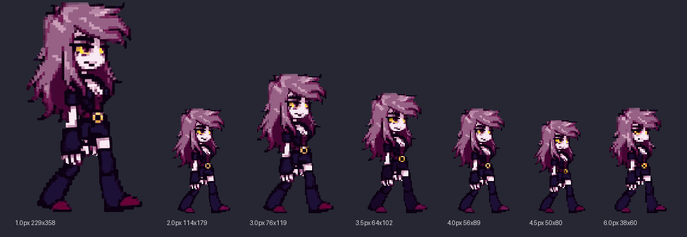

5. **Reconstruct.** `reconstruct.py` runs every frame through Retro Diffusion's [pixel-art-fixer](https://github.com/Retro-Diffusion/pixel-art-fixer) at the one cell size you picked, keeps each frame's own colours, then removes background coloured specks on the silhouette edge. Nothing is averaged across frames, so the result stays faithful to the video.

   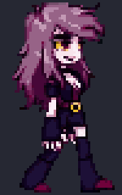

   **Feet anchored grid (default).** Left alone, the fixer picks a grid phase for each frame from where the edges happen to fall, so a smooth 4 px bob in the video turns into the whole sprite popping up and down by a cell and the feet never sit on the same row. `reconstruct.py` now measures the feet baseline of every frame, takes the median over the cycle, and shifts each frame by a few pixels before the fixer sees it so that the feet sit on the median's grid row and the torso keeps its column phase. Only frames within 0.6 of a cell of the median are pinned, so 1 or 2 px of jitter disappears while a real lift (a heel coming off the ground at the crossing pose, a jump) snaps to its own nearest row and stays visible. Nothing is copied between frames, every frame is still its own reconstruction. On the goth girl this took head row changes from 11 to 4 (the 4 are the real bob), feet row changes from 12 to 0, and cut the outline flicker by about a tenth and colour pops by a fifth.

   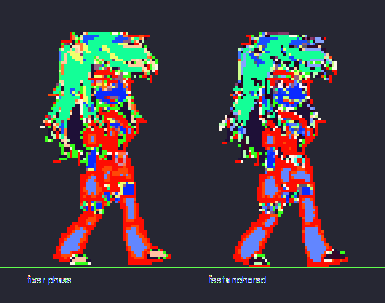

   `ANCHOR=none` switches it off and the fixer picks its own phase again.

6. **Cut and package.** Keep one frame, drop two, play at 8 fps. You get `frames/`, a sheet at 1x and 4x, a timing JSON with the loop flag and the grid size, a loop GIF and the magenta check sheet.

   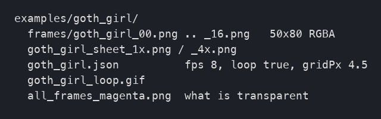

Optional, never applied by default: `stabilize_head.py` can copy the face of frame 0 onto every frame or pin the head position. It makes the eyes and mouth perfectly steady at the cost of a visible seam on characters with big moving hair. Try it, judge it, keep the faithful build if in doubt.

## Quick start

```
git clone https://github.com/Retro-Diffusion/pixel-art-fixer ~/Projects/pixel-art-fixer
pip install -r requirements.txt

python3 scripts/intake.py my_clip.mp4 work/my_char          # read the scorecard, decide
python3 scripts/pipeline_green.py work/my_char my_char       # key, cycle, reconstruct, package
python3 scripts/grid_compare.py work/my_char my_char         # optional: compare cell sizes
```

`pipeline_green.py` reads `intake.json` for the background colour, the cycle length and the detected cell. To force a cell size, run `reconstruct.py` directly:

```
cd work/my_char
KEYDIR=keyed KILLCOV=0.6 BG=46,232,31 python3 ../../scripts/reconstruct.py 24 74 4.5 4.5 0 0 0 out 1
```

Add `ANCHOR=none` to that line to let the fixer pick its own grid phase per frame instead of pinning the feet, or `ANCHOR_TOL=0.3` to treat smaller baseline movements as real lifts.

For clips on a white or black background use `key_white.py` instead of `key_green.py` and expect to tune it per character: parts of the character that share the background colour (eye whites on white, a black dress on black) cannot be told apart by any rule. Green screen avoids the whole problem.

## Using it with an AI agent

The repo ships an [AGENTS.md](AGENTS.md) (and an identical `CLAUDE.md`) that Codex, Claude Code and most coding agents read automatically when they work inside the folder. It tells the agent to run the intake first and show you the scorecard, to treat green screen as the expected input, to check every result on magenta before showing it, and to offer the optional steps (grid comparison, frame cut, stabilisation) instead of applying them silently.

To use it, clone the repo and start your agent inside it, then say something like:

```
Here is a clip of my character: ~/Downloads/my_clip.mp4. Turn it into a sprite sheet following AGENTS.md.
```

If your agent works from a different folder, paste the contents of `AGENTS.md` into its instructions or point it at the file.

## Examples

Each character: the original clip, the seven cell sizes side by side, and the 4.5 px result. Sprite sets at 4.5 and 6.0 px are in [examples/](examples/).

### First girl (white background clip, keyed with key_white)
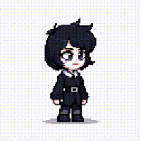
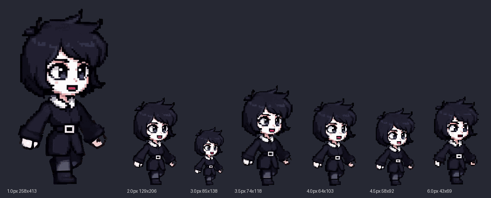
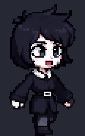

### Hoodie girl

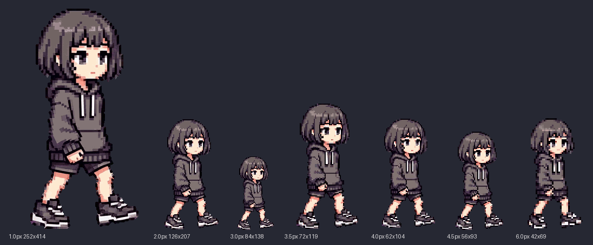
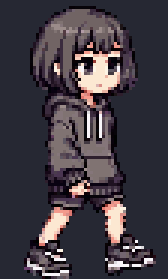

### Goth girl
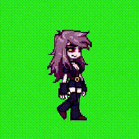


### Spiky guy (green eyes, kept by the enclosed green rule)
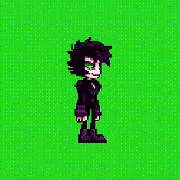
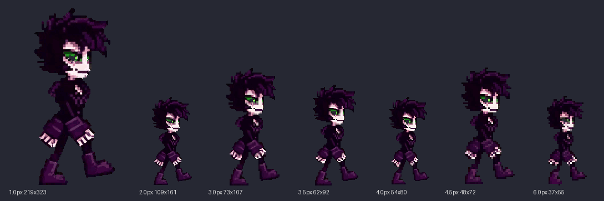
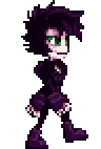

### Jacket boy
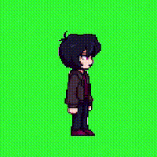
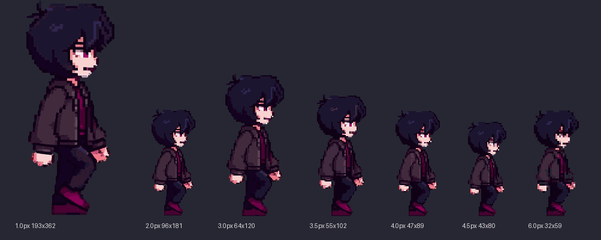
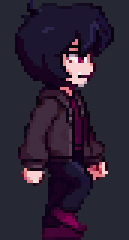

## What the pipeline never does

- Fill holes blindly on a black background, or reopen pockets without a colour gate.
- Lock or vote colours across frames. Faithful is the default; stabilisation is an explicit option.
- Check its own output on a dark preview. Magenta only.
- Reuse keyed frames from an earlier run when the cycle range changes. Re-key the whole clip.

## Credits

Reconstruction by [pixel-art-fixer](https://github.com/Retro-Diffusion/pixel-art-fixer) (Retro Diffusion, MIT). Example clips generated with Grok.
